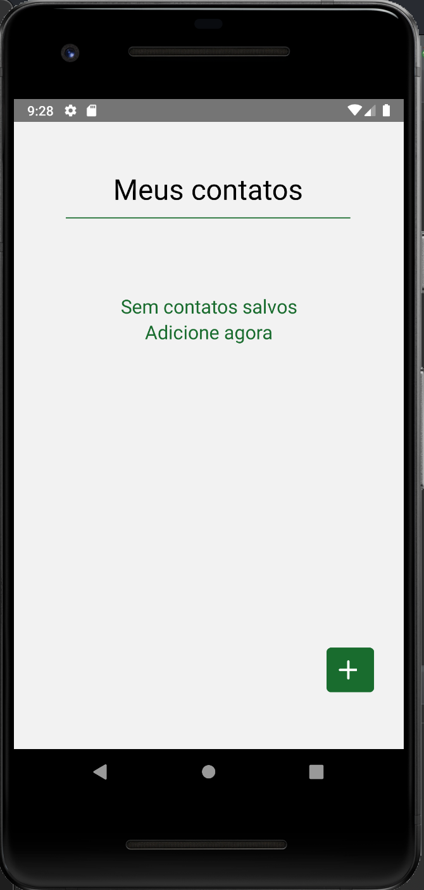
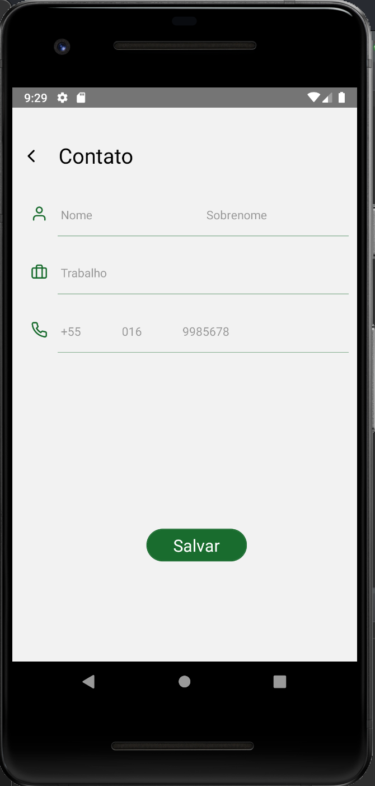
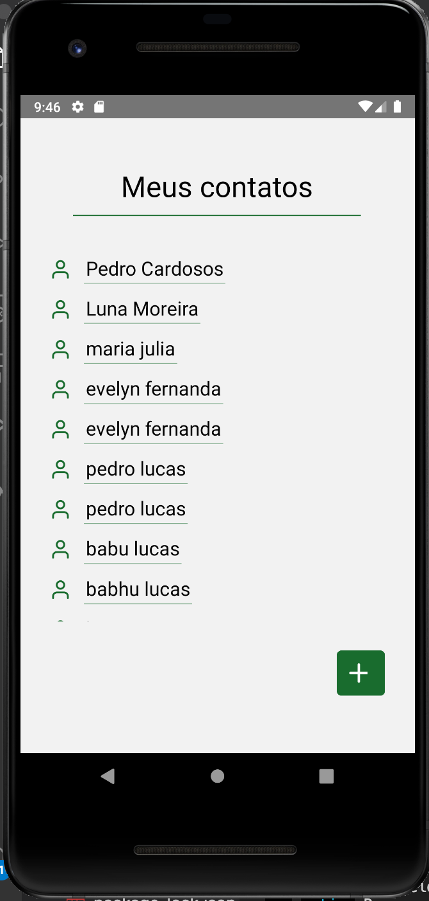
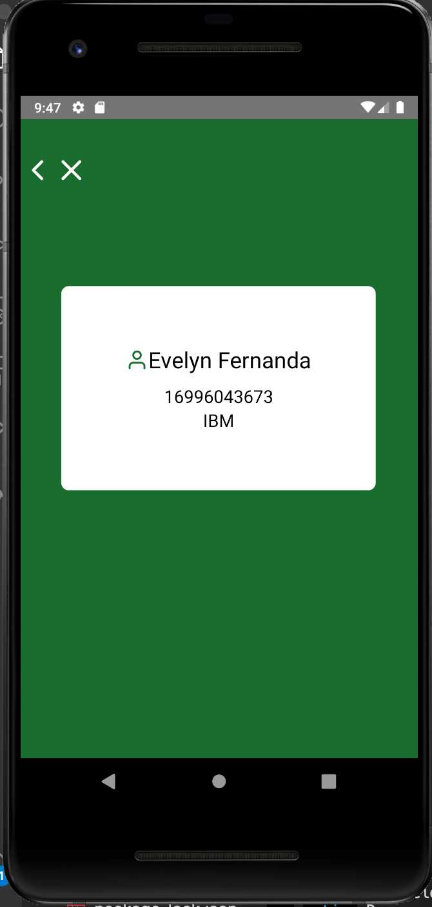

# Agenda 

## Sobre

Projeto realizado utilizando:
- React Navigation 
- React Native CLI
- Axios, com get e post 
- banco de dados MySQL
- Java com Spring Boot no back
- Emulador Android Studio
- IDE: Visual Studio Code

## App:

- Tela inicial sem contatos 

- Tela de cadastro de contato

- Tela com a lista de contatos salvos no banco de dados

- Tela de visualização de contato selecionado

